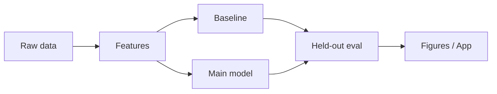

# Energy Visualization Lab
> A visualization design system for time-series energy data — 12 chart types, one coherent visual language, light and dark.


<!--  — generated by `make figures` once real data is present -->

## TL;DR
- **Problem:** A visualization design system for time-series energy data — 12 chart types, one coherent visual language, light and dark.
- **Data:** Smart Meters in London + Ember / CEA open generation data ([source](https://www.kaggle.com/datasets/jeanmidev/smart-meters-in-london))
- **Approach:**
  - Baseline: default matplotlib styling
  - Main: shared theme + 12 chart recipes with chart-choice guide
  - Evaluate with held-out protocol stated in `src/energyviz/evaluate.py`
- **Result:** *Pending first real training run — never fabricate metrics.* Headline will compare main vs baseline on: accessibility checks (contrast, colorblind-safe palettes)
- **Live demo:** GitHub Pages

## Results

| Approach | Primary metric | Notes |
|---|---|---|
| Baseline (default matplotlib styling) | — | to be filled by `make run` |
| **Main** | — | to be filled by `make run` |

## How it works



shared theme + 12 chart recipes with chart-choice guide is compared against default matplotlib styling under an explicit split strategy documented in code. Randomness is seeded.

## Reproduce

```bash
git clone https://github.com/divyantpratap/12-energy-viz-lab.git
cd 12-energy-viz-lab
make setup
make data    # downloads into data/raw (not committed)
make run     # train + evaluate + figures
make test
```

## Project structure

```
12-energy-viz-lab/
├── README.md
├── Makefile
├── requirements.txt
├── src/energyviz/
├── scripts/
├── tests/
├── data/sample/
├── assets/
└── notebooks/01_exploration.ipynb
```

## Limitations & next steps

- Scaffold ships with synthetic `data/sample/` so CI and local smoke tests work before the full dataset download.
- Real metrics are produced only after `make data && make run` against the public source above.
- Next: wire the full download path, complete the main model, regenerate README figures from `scripts/make_figures.py`.

## Data & license

- Source: https://www.kaggle.com/datasets/jeanmidev/smart-meters-in-london
- See `data/README.md` for license notes. Raw data is never committed.
- Code: MIT (see `LICENSE`).
